# MATLAB Deep Learning Model Hub

Discover pretrained models for deep learning in MATLAB.

## Models <a name="Models"/>

### Computer Vision
* [Image Classification](#ImageClassification)
* [Object Detection](#ObjectDetection)
* [Semantic Segmentation](#SemanticSegmentation)
* [Instance Segmentation](#InstanceSegmentation)
* [Image Translation](#ImageTranslation)
* [Pose Estimation](#PoseEstimation)
* [Video Classification](#VideoClassification)
* [Text Detection & Recognition](#textdetection)

### Natural Language Processing
* [Transformers](#transformers)

### Audio
* [Audio Embeddings](#Audio)
* [Sound Classification](#SoundClassification)
* [Pitch Estimation](#PitchEstimation)
* [Speech to Text](#Speech2Text)

### Lidar 
* [Point Cloud Classification](#PointCloud)
* [Point Cloud Segmentation](#PointCloudSeg)
* [Point Cloud Object Detection](#PointCloudObj)

## Image Classification <a name="ImageClassification"/>

Pretrained image classification networks have already learned to extract powerful and informative features from natural images. Use them as a starting point to learn a new task using transfer learning. 

Inputs are RGB images, the output is the predicted label and score:

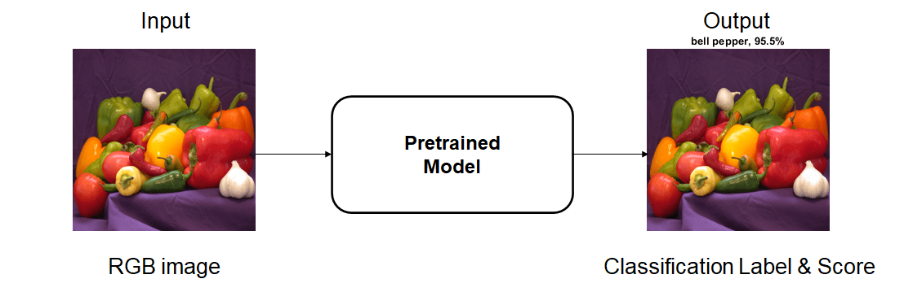

These networks have been trained on more than a million images and can classify images into 1000 object categories. 

**Models available in MATLAB:**

| Network |   Size (MB)  | Classes | Accuracy % | Location | 
| ------------- | ------------- | ------------- |  ------------- |  ------------- | 
| [googlenet](https://www.mathworks.com/help/deeplearning/ref/googlenet.html) | 27| 1000| 66.25 |[Doc](https://www.mathworks.com/help/deeplearning/ref/googlenet.html)  [GitHub](https://github.com/matlab-deep-learning/googlenet) |
| [squeezenet](https://www.mathworks.com/help/deeplearning/ref/squeezenet.html)   | 5.2|  1000| 55.16 |[Doc](https://www.mathworks.com/help/deeplearning/ref/squeezenet.html) |
| [alexnet](https://www.mathworks.com/help/deeplearning/ref/alexnet.html)  |  227|  1000|54.10|[Doc](https://www.mathworks.com/help/deeplearning/ref/alexnet.html) |
| [resnet18](https://www.mathworks.com/help/deeplearning/ref/resnet18.html)   |  44|  1000|69.49|[Doc](https://www.mathworks.com/help/deeplearning/ref/resnet18.html)  [GitHub](https://github.com/matlab-deep-learning/resnet-18) |
| [resnet50](https://www.mathworks.com/help/deeplearning/ref/resnet50.html)   |  96|  1000|74.46|[Doc](https://www.mathworks.com/help/deeplearning/ref/resnet50.html)  [GitHub](https://github.com/matlab-deep-learning/resnet-50) |
| [resnet101](https://www.mathworks.com/help/deeplearning/ref/resnet101.html)   |  167|  1000|75.96|[Doc](https://www.mathworks.com/help/deeplearning/ref/resnet101.html)  [GitHub](https://github.com/matlab-deep-learning/resnet-101) |
| [mobilenetv2](https://www.mathworks.com/help/deeplearning/ref/mobilenetv2.html)    | 13| 1000| 70.44|[Doc](https://www.mathworks.com/help/deeplearning/ref/mobilenetv2.html)  [GitHub](https://github.com/matlab-deep-learning/mobilenet-v2) |
| [vgg16](https://www.mathworks.com/help/deeplearning/ref/vgg16.html)    |  515|  1000|70.29|[Doc](https://www.mathworks.com/help/deeplearning/ref/vgg16.html) |
| [vgg19](https://www.mathworks.com/help/deeplearning/ref/vgg19.html)    |  535|  1000|70.42|[Doc](https://www.mathworks.com/help/deeplearning/ref/vgg19.html) |
| [inceptionv3](https://www.mathworks.com/help/deeplearning/ref/inceptionv3.html) | 89|  1000|77.07|[Doc](https://www.mathworks.com/help/deeplearning/ref/inceptionv3.html) |
| [inceptionresnetv2](https://www.mathworks.com/help/deeplearning/ref/inceptionresnetv2.html)  | 209|  1000|79.62|[Doc](https://www.mathworks.com/help/deeplearning/ref/inceptionresnetv2.html) |
| [xception](https://www.mathworks.com/help/deeplearning/ref/xception.html)   |  85|  1000|78.20|[Doc](https://www.mathworks.com/help/deeplearning/ref/xception.html) |
| [darknet19](https://www.mathworks.com/help/deeplearning/ref/darknet19.html)   |  78| 1000|74.00|[Doc](https://www.mathworks.com/help/deeplearning/ref/darknet19.html) |
| [darknet53](https://www.mathworks.com/help/deeplearning/ref/darknet53.html)    |  155|  1000|76.46|[Doc](https://www.mathworks.com/help/deeplearning/ref/darknet53.html) |
| [densenet201](https://www.mathworks.com/help/deeplearning/ref/densenet201.html)    | 77| 1000| 75.85|[Doc](https://www.mathworks.com/help/deeplearning/ref/densenet201.html) |
| [shufflenet](https://www.mathworks.com/help/deeplearning/ref/shufflenet.html)   | 5.4|  1000|63.73|[Doc](https://www.mathworks.com/help/deeplearning/ref/shufflenet.html) |
| [nasnetmobile](https://www.mathworks.com/help/deeplearning/ref/nasnetmobile.html)    | 20|  1000|73.41|[Doc](https://www.mathworks.com/help/deeplearning/ref/nasnetmobile.html) |
| [nasnetlarge](https://www.mathworks.com/help/deeplearning/ref/nasnetlarge.html)    |  332| 1000|81.83|[Doc](https://www.mathworks.com/help/deeplearning/ref/nasnetlarge.html) |
| [efficientnetb0](https://www.mathworks.com/help/deeplearning/ref/efficientnetb0.html)   | 20|  1000|74.72|[Doc](https://www.mathworks.com/help/deeplearning/ref/efficientnetb0.html) |
| [ConvMixer](https://github.com/matlab-deep-learning/convmixer-patches-are-all-you-need)   | 7.7|  10|-|[GitHub](https://github.com/matlab-deep-learning/convmixer-patches-are-all-you-need) |

**Tips for selecting a model**

Pretrained networks have different characteristics that matter when choosing a network to apply to your problem. The most important characteristics are network accuracy, speed, and size. Choosing a network is generally a tradeoff between these characteristics. The following figure highlights these tradeoffs:

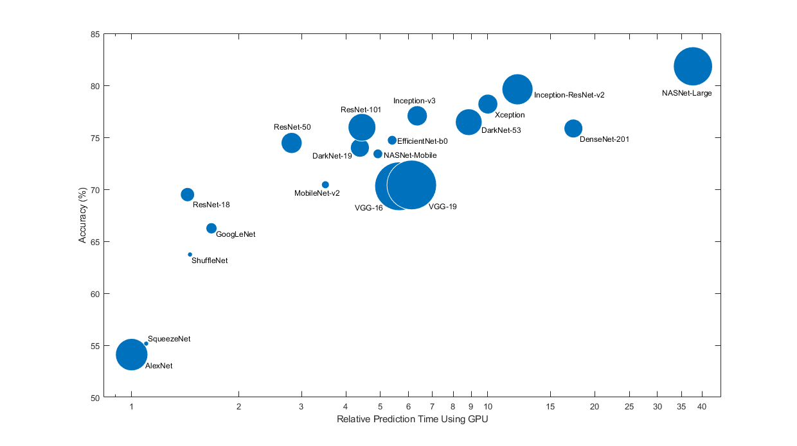
Figure. Comparing image classification model accuracy, speed and size.

[Back to top](#Models)

## Object Detection <a name="ObjectDetection"/>

Object detection is a computer vision technique used for locating instances of objects in images or videos. When humans look at images or video, we can recognize and locate objects of interest within a matter of moments. The goal of object detection is to replicate this intelligence using a computer.

Inputs are RGB images, the output is the predicted label, bounding box and score:

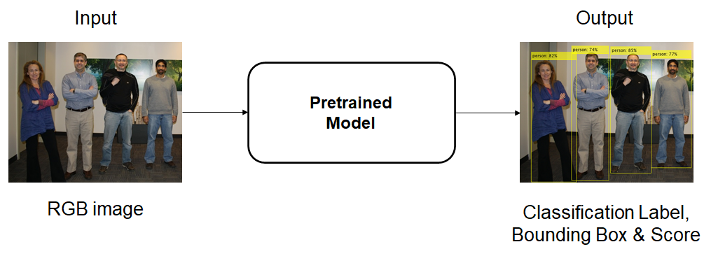

These networks have been trained to detect 80 objects classes from the COCO dataset. These models are suitable for training a custom object detector using transfer learning.

| Network  | Backbone Networks |  Size (MB) | Mean Average Precision (mAP) |Object Classes | Location |
| ------------- | ------------- |------------ | ------------- |------------ |------------ |
| [EfficientDet-D0](https://github.com/matlab-deep-learning/pretrained-efficientdet-d0) | efficientnet |15.9 | 33.7 |80 |[GitHub](https://github.com/matlab-deep-learning/pretrained-efficientdet-d0) | 
| [YOLOX](https://github.com/matlab-deep-learning/Pretrained-YOLOX-Network-For-Object-Detection) | YoloX-s YoloX-m YoloX-l | 32   90.2 192.9 | 39.8  45.9 48.6|80 |[GitHub](https://github.com/matlab-deep-learning/Pretrained-YOLOX-Network-For-Object-Detection)| 
| [YOLO v4](https://www.mathworks.com/help/vision/ref/yolov4objectdetector.html) | yolov4-coco   yolov4-tiny-coco| 229   21.5 | 44.2  19.7|80 |[Doc](https://www.mathworks.com/help/vision/ref/yolov4objectdetector.html) [GitHub](https://github.com/matlab-deep-learning/pretrained-yolo-v4)| 
| [YOLO v3](https://www.mathworks.com/help/vision/ref/yolov3objectdetector.html)| darknet53-coco   tiny-yolov3-coco | 220.4   31.5 | 34.4   9.3 |80 |[Doc](https://www.mathworks.com/help/vision/ref/yolov3objectdetector.html) |
| [YOLO v2](https://github.com/matlab-deep-learning/Object-Detection-Using-Pretrained-YOLO-v2)   | darknet19-VOC   darknet19-COCO  tiny-yolo_v2-coco|180   181   40 | 75.4   28.7   10.5 |80 |[GitHub](https://github.com/matlab-deep-learning/Object-Detection-Using-Pretrained-YOLO-v2)|

**Tips for selecting a model**

Pretrained object detectors have different characteristics that matter when choosing a network to apply to your problem. The most important characteristics are mean average precision (mAP), speed, and size. Choosing a network is generally a tradeoff between these characteristics.

**Application Specific Object Detectors**

These networks have been trained to detect specific objects for a given application.
| Network  | Application |Size (MB) |Location |Example Output |
| ------------- | ------------- | ------------- |------------- |------------- |
| [Spatial-CNN](https://github.com/matlab-deep-learning/pretrained-spatial-CNN)   | Lane detection | 74 |[GitHub ](https://github.com/matlab-deep-learning/pretrained-spatial-CNN)|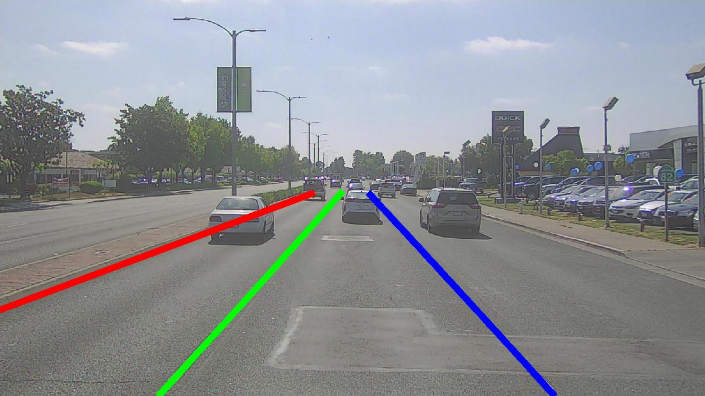|
| [Single Shot Detector (SSD)](https://www.mathworks.com/help/vision/ug/object-detection-using-single-shot-detector.html)   | Vehicle detection | 44 |[Doc ](https://www.mathworks.com/help/vision/ug/object-detection-using-single-shot-detector.html)|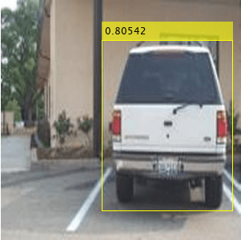|
| [Faster R-CNN](https://www.mathworks.com/help/vision/ug/object-detection-using-faster-r-cnn-deep-learning.html)   | Vehicle detection | 118 |[Doc](https://www.mathworks.com/help/vision/ug/object-detection-using-faster-r-cnn-deep-learning.html)||

[Back to top](#Models)

## Semantic Segmentation <a name="SemanticSegmentation"/>

Segmentation is essential for image analysis tasks. Semantic segmentation describes the process of associating each pixel of an image with a class label, (such as flower, person, road, sky, ocean, or car). 

Inputs are RGB images, outputs are pixel classifications (semantic maps).
 

This network has been trained to detect 20 objects classes from the PASCAL VOC dataset:

| Network  | Size (MB)| Mean Accuracy | Object Classes| Location | 
| ------------- | ------------- |------------- |------------- |------------- |
| [DeepLabv3+](https://github.com/matlab-deep-learning/pretrained-deeplabv3plus)   | 209 | 0.87 | 20 | [GitHub](https://github.com/matlab-deep-learning/pretrained-deeplabv3plus) |

**Application Specific Semantic Segmentation Models**
| Network  | Application |Size (MB) |Location |Example Output |
| ------------- | ------------- | ------------- |------------- |------------- |
| [U-net](https://www.mathworks.com/help/images/develop-raw-camera-processing-pipeline-using-deep-learning.html)   | Raw Camera Processing |31 |[Doc](https://www.mathworks.com/help/images/develop-raw-camera-processing-pipeline-using-deep-learning.html) | 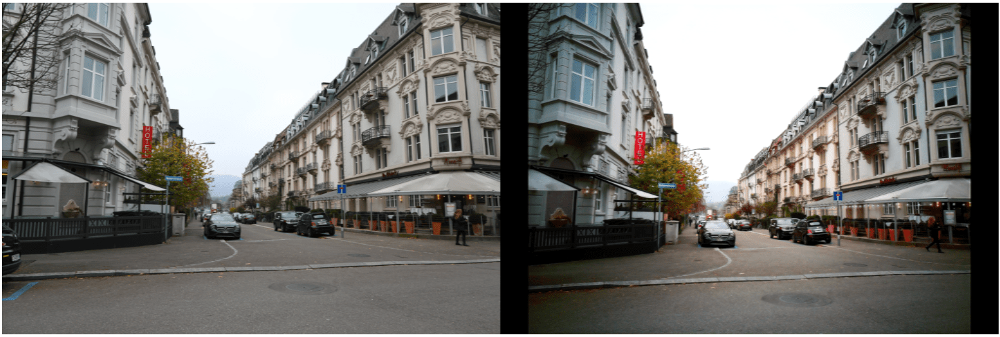|
| [3-D U-net](https://www.mathworks.com/help/images/segment-3d-brain-tumor-using-deep-learning.html) | Brain Tumor Segmentation  | 56.2 | [Doc](https://www.mathworks.com/help/images/segment-3d-brain-tumor-using-deep-learning.html) | 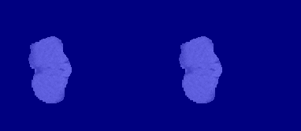|
| [AdaptSeg (GAN)](https://www.mathworks.com/help/deeplearning/ug/train-deep-learning-semantic-segmentation-network-using-3d-simulation-data.html)  | Model tuning using 3-D simulation data | 54.4 | [Doc](https://www.mathworks.com/help/deeplearning/ug/train-deep-learning-semantic-segmentation-network-using-3d-simulation-data.html) |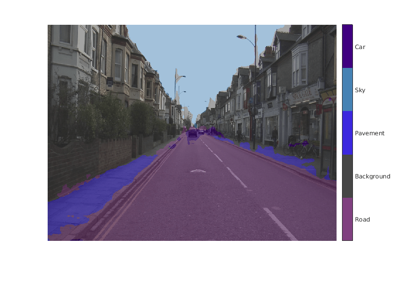|

[Back to top](#Models)

## Instance Segmentation <a name="InstanceSegmentation"/>

Instance segmentation is an enhanced type of object detection that generates a segmentation map for each detected instance of an object. Instance segmentation treats individual objects as distinct entities, regardless of the class of the objects. In contrast, semantic segmentation considers all objects of the same class as belonging to a single entity.

Inputs are RGB images, outputs are pixel classifications (semantic maps), bounding boxes and classification labels.

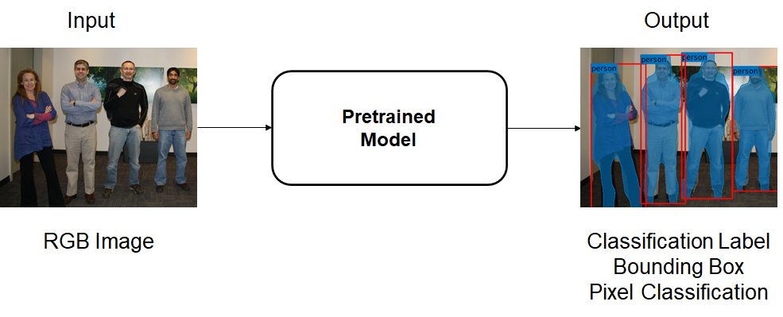

| Network | Object Classes | Location |
| ------------- | ------------- |------------- |
| [Mask R-CNN](https://www.mathworks.com/help/vision/ref/maskrcnn.html) | 80 | [Doc](https://www.mathworks.com/help/vision/ref/maskrcnn.html)    [Github](https://github.com/matlab-deep-learning/mask-rcnn)|

[Back to top](#Models)

## Image Translation <a name="ImageTranslation"/>

Image translation is the task of transferring styles and characteristics from one image domain to another. This technique can be extended to other image-to-image learning operations, such as image enhancement, image colorization, defect generation, and medical image analysis.

Inputs are images, outputs are translated RGB images. This example workflow shows how a semantic segmentation map input translates to a synthetic image via a pretrained model (Pix2PixHD):

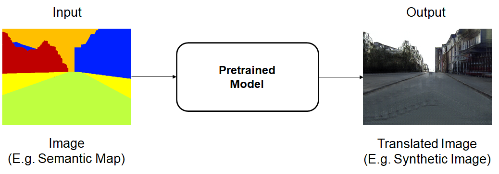

| Network  | Application |Size (MB) |Location |Example Output |
| ------------- | ------------- | ------------- |------------- |------------- |
| [Pix2PixHD(CGAN)](https://www.mathworks.com/help/deeplearning/ug/generate-image-from-segmentation-map-using-deep-learning.html) | Synthetic Image Translation | 648 | [Doc](https://www.mathworks.com/help/deeplearning/ug/generate-image-from-segmentation-map-using-deep-learning.html) | |
| [UNIT (GAN)](https://www.mathworks.com/help/images/unsupervised-day-to-dusk-image-translation-using-unit.html) | Day-to-Dusk Dusk-to-Day Image Translation | 72.5 | [Doc](https://www.mathworks.com/help/images/unsupervised-day-to-dusk-image-translation-using-unit.html) |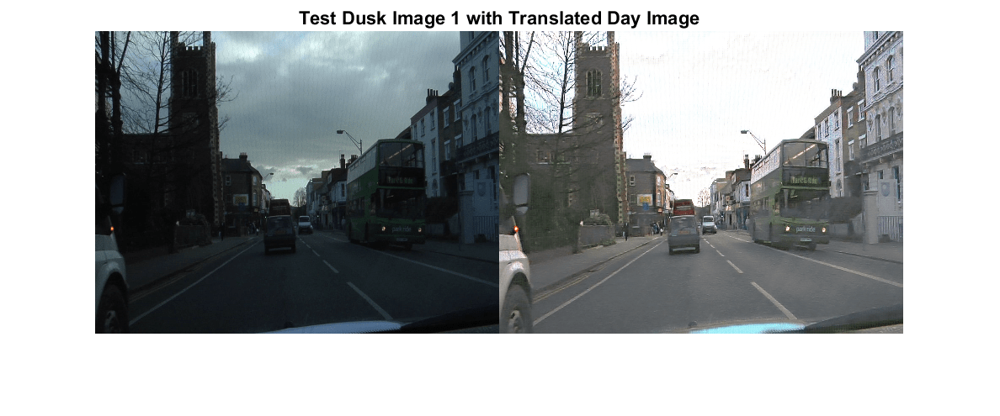|
| [UNIT (GAN)](https://www.mathworks.com/help/images/unsupervised-medical-image-denoising-using-unit.html) | Medical Image Denoising | 72.4 | [Doc](https://www.mathworks.com/help/images/unsupervised-medical-image-denoising-using-unit.html) |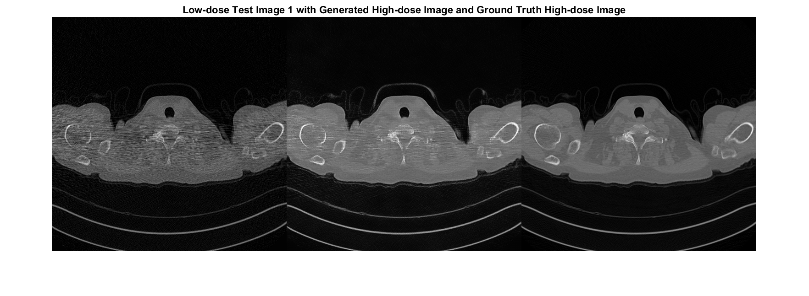|
| [CycleGAN](https://www.mathworks.com/help/images/unsupervised-medical-image-denoising-using-cyclegan.html) | Medical Image Denoising | 75.3 | [Doc](https://www.mathworks.com/help/images/unsupervised-medical-image-denoising-using-cyclegan.html) ||
| [VDSR](https://www.mathworks.com/help/images/single-image-super-resolution-using-deep-learning.html) | Super Resolution (estimate a high-resolution image from a low-resolution image) | 2.4 | [Doc](https://www.mathworks.com/help/images/single-image-super-resolution-using-deep-learning.html) |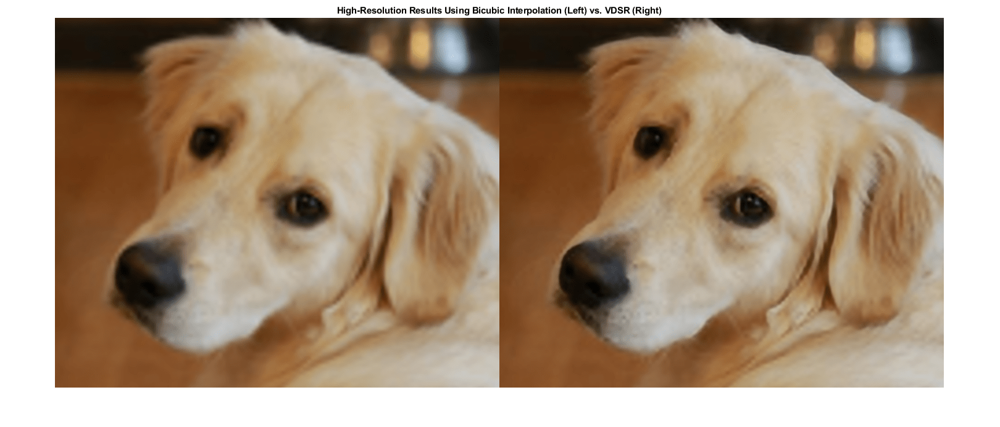|

[Back to top](#Models)

## Pose Estimation <a name="PoseEstimation"/>

Pose estimation is a computer vision technique for localizing the position and orientation of an object using a fixed set of keypoints. 

All inputs are RGB images, outputs are heatmaps and part affinity fields (PAFs) which via post processing perform pose estimation.

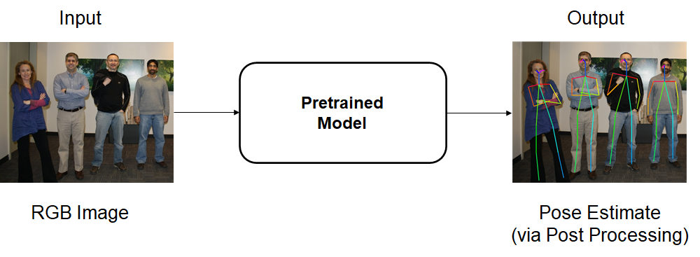

| Network  | Size (MB)| Location|
| ------------- | ------------- |------------- |
| [OpenPose](https://www.mathworks.com/help/deeplearning/ug/estimate-body-pose-using-deep-learning.html)   | 14 | [Doc](https://www.mathworks.com/help/deeplearning/ug/estimate-body-pose-using-deep-learning.html) |

[Back to top](#Models)

## Video Classification <a name="VideoClassification"/>

Video classification is a computer vision technique for classifying the action or content in a sequence of video frames. 

All inputs are Videos only or Video with Optical Flow data, outputs are gesture classifications and scores.

| Network  | Inputs | Size(MB) | Classifications (Human Actions)| Description | Location|
| ------------- | ------------- |------------- |------------- |------------- |------------- |
| [SlowFast](https://www.mathworks.com/help/vision/ref/slowfastvideoclassifier.html) | Video | 124 |400 |Faster convergence than Inflated-3D |[Doc](https://www.mathworks.com/help/vision/ref/slowfastvideoclassifier.html)
| [R(2+1)D](https://www.mathworks.com/help/vision/ref/r2plus1dvideoclassifier.html) | Video | 112 |400 |Faster convergence than Inflated-3D|[Doc](https://www.mathworks.com/help/vision/ref/r2plus1dvideoclassifier.html)
| [Inflated-3D](https://www.mathworks.com/help/vision/ref/inflated3dvideoclassifier.html) | Video & Optical Flow data | 91 | 400 |Accuracy of the classifier improves when combining optical flow and RGB data.| [Doc](https://www.mathworks.com/help/vision/ref/inflated3dvideoclassifier.html)

[Back to top](#Models)

## Text Detection and Recognition <a name="textdetection"/>

Text detection is a computer vision technique used for locating instances of text within in images.

Inputs are RGB images, outputs are bounding boxes that identify regions of text.

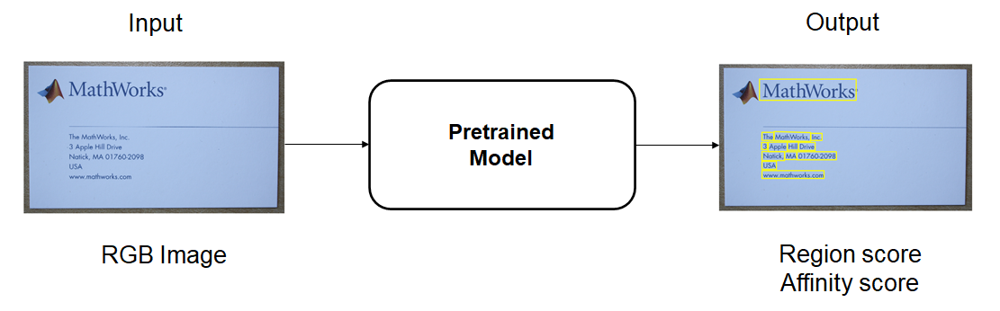

| Network  | Application | Size (MB) | Location |
| ------------- | ------------- |------------- |------------- |
| [CRAFT](https://www.mathworks.com/help/vision/ref/detecttextcraft.html)   | Trained to detect English, Korean, Italian, French, Arabic, German and Bangla (Indian).| 3.8 |[Doc](https://www.mathworks.com/help/vision/ref/detecttextcraft.html)   [GitHub](https://github.com/matlab-deep-learning/Text-Detection-using-Deep-Learning) |

**Application Specific Text Detectors**

| Network  | Application | Size (MB) | Location |Example Output |
| ------------- | ------------- |------------- |------------- |------------- |
| [Seven Segment Digit Recognition](https://github.com/matlab-deep-learning/Seven-Segment-Digit-Recognition)   |Seven segment digit recognition using deep learning and OCR. This is helpful in industrial automation applications where digital displays are often surrounded with complex background. | 3.8 |[GitHub](https://github.com/matlab-deep-learning/Seven-Segment-Digit-Recognition)  |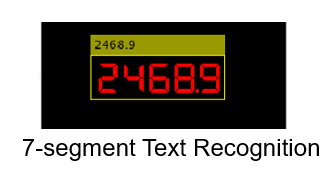|

[Back to top](#Models)

## Transformers (Text) <a name="transformers"/>

Transformer pretained models have already learned to extract powerful and informative features features from text. Use them as a starting point to learn a new task using transfer learning. 

Inputs are sequences of text, outputs are text feature embeddings.

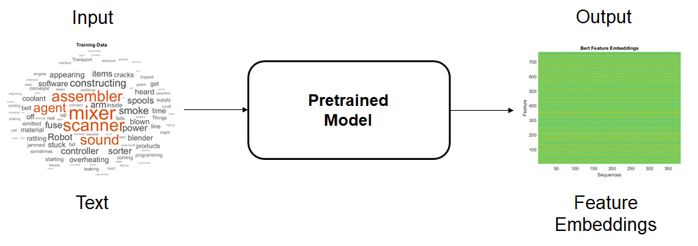

| Network  |  Size (MB) | Location |
| ------------- | ------------- |------------ |
| [BERT](https://github.com/matlab-deep-learning/transformer-models#bert-and-finbert)   | 390 |[GitHub](https://github.com/matlab-deep-learning/transformer-models#bert-and-finbert)  | 

**Application Specific Transformers**

| Network  | Application | Size (MB) | Location | Output Example |
| ------------- | ------------- | ------------- |------------- |------------- |
| [FinBERT](https://github.com/matlab-deep-learning/transformer-models#bert-and-finbert)   | The FinBERT model is a BERT model for financial sentiment analysis | 388 |[GitHub](https://github.com/matlab-deep-learning/transformer-models#bert-and-finbert) |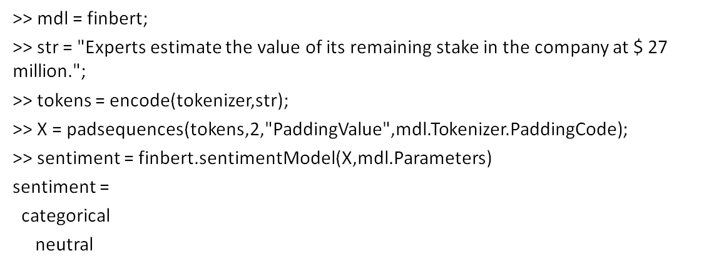|
| [GPT-2](https://github.com/matlab-deep-learning/transformer-models#gpt-2) | The GPT-2 model is a decoder model used for text summarization.| 1.2GB |[GitHub](https://github.com/matlab-deep-learning/transformer-models#gpt-2) |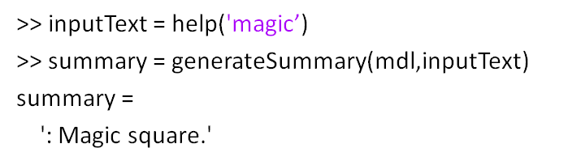|

[Back to top](#Models)

## Audio <a name="Audio"/>

Audio Embedding pretrained models have already learned to extract powerful and informative features from audio signals. Use them as a starting point to learn a new task using transfer learning. 

Inputs are Audio signals, outputs are audio feature embeddings.

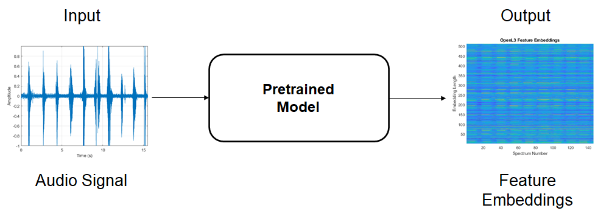

| Network  | Application | Size (MB) | Location |
| ------------- | ------------- | ------------- |------------- |
| [VGGish](https://www.mathworks.com/help/audio/ref/vggish.html)   | Feature Embeddings | 257 |[Doc](https://www.mathworks.com/help/audio/ref/vggish.html) |
| [OpenL3](https://www.mathworks.com/help/audio/ref/openl3.html)   | Feature Embeddings | 200 |[Doc](https://www.mathworks.com/help/audio/ref/openl3.html) |

**Application Specific Audio Models**

| Network  | Application | Size (MB) | Output Classes | Location | Output Example |
| ------------- | ------------- | ------------- |------------- |------------- |------------- |
| <a name="SoundClassification"/>[YAMNet](https://www.mathworks.com/help/audio/ref/yamnet.html)   | Sound Classification | 13.5 | 521 |[Doc](https://www.mathworks.com/help/audio/ref/yamnet.html) ||
| <a name="PitchEstimation"/>[CREPE](https://www.mathworks.com/help/audio/ref/crepe.html)   | Pitch Estimation (Regression) | 132| - |[Doc](https://www.mathworks.com/help/audio/ref/crepe.html) |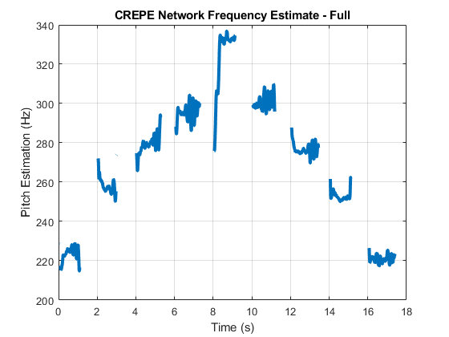|

## Speech to Text <a name="Speech2Text"/>

Speech to text pretrained models take an audio input and translate it into a text output. They are useful in digitizating audio files for downstream text processing tasks such as text summarization and sentiment analysis.

Inputs are Audio signals, outputs is text.

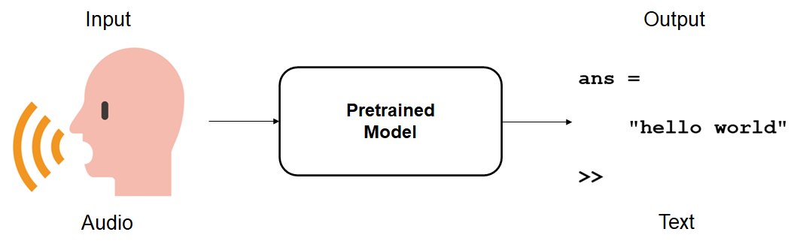

| Network  | Application | Size (MB) | Word Error Rate (WER) | Location | 
| ------------- | ------------- | ------------- |------------- |------------- |
| [wav2vec](https://github.com/matlab-deep-learning/wav2vec-2.0)   | Speech to Text | 236| 3.2 |[GitHub](https://github.com/matlab-deep-learning/wav2vec-2.0) |
| [deepspeech](https://github.com/matlab-deep-learning/deepspeech)   | Speech to Text | 167| 5.97 |[GitHub](https://github.com/matlab-deep-learning/deepspeech) |

[Back to top](#Models)

## Lidar <a name="PointCloud"/>

Point cloud data is acquired by a variety of sensors, such as lidar, radar, and depth cameras. Training robust classifiers with point cloud data is challenging because of the sparsity of data per object, object occlusions, and sensor noise. Deep learning techniques have been shown to address many of these challenges by learning robust feature representations directly from point cloud data. 

Inputs are Lidar Point Clouds converted to five-channels, outputs are segmentation, classification or object detection results overlayed on point clouds.

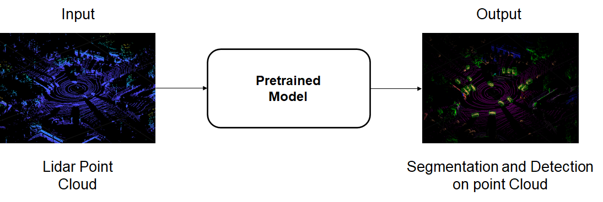

| Network  | Application | Size (MB) | Object Classes | Location | 
| ------------- | ------------- | ------------- |------------- |------------- |
| [PointNet](https://www.mathworks.com/help/vision/ug/point-cloud-classification-using-pointnet-deep-learning.html)  | Classification | 5| 14 |[Doc](https://www.mathworks.com/help/vision/ug/point-cloud-classification-using-pointnet-deep-learning.html)|
| <a name="PointCloudSeg"/>[PointNet++](https://www.mathworks.com/help/lidar/ug/aerial-lidar-segmentation-using-pointnet-network.html)  | Segmentation | 3| 8 |[Doc](https://www.mathworks.com/help/lidar/ug/aerial-lidar-segmentation-using-pointnet-network.html)|
| [PointSeg](https://www.mathworks.com/help/deeplearning/ug/lidar-semantic-segmentation-using-pointseg.html)   | Segmentation | 14| 3 |[Doc](https://www.mathworks.com/help/vision/ug/point-cloud-classification-using-pointnet-deep-learning.html)|
| [SqueezeSegV2](https://www.mathworks.com/help/deeplearning/ug/lidar-semantic-segmentation-using-squeezesegv2.html)   | Segmentation |5| 12 |[Doc](https://www.mathworks.com/help/deeplearning/ug/lidar-semantic-segmentation-using-squeezesegv2.html) |
| [SalsaNext](https://github.com/matlab-deep-learning/pretrained-salsanext)   | Segmentation |20.9 | 13 |[GitHub](https://github.com/matlab-deep-learning/pretrained-salsanext)|
| <a name="PointCloudObj"/>[PointPillars](https://www.mathworks.com/help/lidar/ug/object-detection-using-pointpillars-network.html)   | Object Detection | 8| 3 |[Doc](https://www.mathworks.com/help/lidar/ug/object-detection-using-pointpillars-network.html)|
| [Complex YOLO v4](https://github.com/matlab-deep-learning/Lidar-object-detection-using-complex-yolov4)   | Object Detection | 233 (complex-yolov4)   21 (tiny-complex-yolov4) | 3 |[GitHub](https://github.com/matlab-deep-learning/Lidar-object-detection-using-complex-yolov4)|

[Back to top](#Models)

## Model requests
If you'd like to request MATLAB support for additional pretrained models, [**please create an issue from this repo**](https://docs.github.com/en/issues/tracking-your-work-with-issues/creating-an-issue). 

Alternatively send the request through to:

[David Willingham](https://www.linkedin.com/in/davidwillingham/)   
Deep Learning Product Manager   
dwilling@mathworks.com

Copyright 2022, The MathWorks, Inc.

